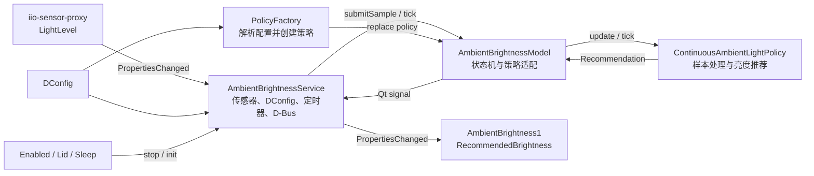
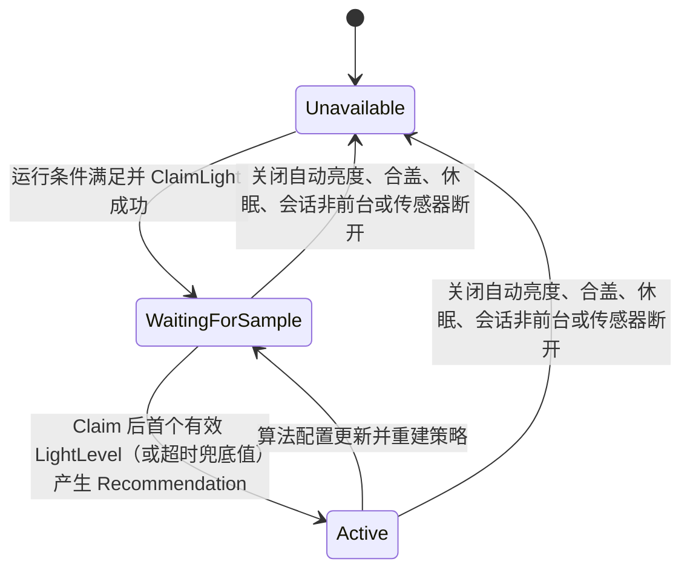

# ambient-brightness

`ambient-brightness` 是 DDE 会话级自动亮度推荐插件。它从 `iio-sensor-proxy` 获取环境光照度（lux），经过平滑、滞回、防抖和亮度映射后，对外发布 `[0.0, 1.0]` 范围的推荐亮度。

本模块只负责计算和发布推荐值，不直接修改显示器亮度。Display 服务或其他消费者决定是否以及如何应用该推荐值。

## 模块功能

- 监听 system bus 上的 `net.hadess.SensorProxy`，读取环境光传感器数据。
- 校验、缓存并处理 lux 样本，抑制噪声、短时遮挡和阈值附近抖动。
- 支持连续曲线 lux 到亮度映射，使用 log1p 空间分段线性插值。
- 在 session bus 上发布推荐亮度和传感器状态。
- 监听传感器服务注册、注销，支持传感器服务重启和热插拔。
- 监听本模块 DConfig 的 `ambientLightAdjustBrightness`：关闭时 `ReleaseLight`，开启时重新初始化光感。
- 监听合盖/开盖和休眠/唤醒事件，在不可用阶段停止光感，恢复后按运行条件重新初始化。
- 监听算法 DConfig，运行时重建策略并应用新配置，无需重启插件。
- 在没有新传感器事件时，通过单次定时器完成 debounce 到期确认，不伪造传感器样本。

## 外部接口

### 传感器输入

| 项目 | 值 |
| --- | --- |
| Bus | system bus |
| Service | `net.hadess.SensorProxy` |
| Object path | `/net/hadess/SensorProxy` |
| Interface | `net.hadess.SensorProxy` |
| 输入属性 | `LightLevel` |
| 变化信号 | `org.freedesktop.DBus.Properties.PropertiesChanged` |

只有自动亮度已开启、上盖打开、系统未休眠且当前登录会话处于前台（`login1.Session.Active=true`）时才会连接传感器。初始化时检查 `HasAmbientLight` 和 `LightLevelUnit`，先订阅 `PropertiesChanged` 再调用 `ClaimLight`，优先使用 Claim 期间或之后收到的首个有效 `LightLevel`；若 2 秒内没有收到信号，则延迟读取一次 `LightLevel` 属性作为兜底。停止时调用 `ReleaseLight` 并清空策略状态。这样可以避免把 Claim 时刻尚未刷新的缓存值或默认值用于初始化。

### 推荐值输出

| 项目 | 值 |
| --- | --- |
| Bus | session bus |
| Service | `org.deepin.dde.AmbientBrightness1` |
| Object path | `/org/deepin/dde/AmbientBrightness1` |
| Interface | `org.deepin.dde.AmbientBrightness1` |

对外属性：

| 属性 | 类型 | 含义 |
| --- | --- | --- |
| `Supported` | `bool` | 当前是否已连接并成功声明环境光传感器 |
| `State` | `string` | 当前状态：`Unavailable`、`Disabled`、`WaitingForSample` 或 `Active` |
| `RecommendedBrightness` | `double` | 推荐亮度，范围 `[0.0, 1.0]` |

属性变化通过标准 `PropertiesChanged` 信号发布。

每次重新 Claim、策略重建或从 `Disabled` 恢复后，首个有效 Recommendation 都会重新发布，即使数值与停止前相同；消费者不需要依赖旧推荐值推断是否应重新应用亮度。

## 总体原理



模块分为四层：

1. **插件入口层**：由 `deepin-service-manager` 加载和销毁服务实例。
2. **服务层**：处理 D-Bus、传感器生命周期、DConfig 和评估定时器。
3. **模型层**：维护对外状态，持有并驱动当前算法策略。
4. **算法层**：只处理带单调时间戳的 lux 样本，返回可选的亮度推荐。

这种分层使算法不依赖 D-Bus；单元测试可以直接向策略或 Model 提交样本。

## 运行流程

### 1. 插件启动

1. `deepin-service-manager` 调用 `DSMRegister`。
2. 创建 `AmbientBrightnessService` 并调用 `initialize()`。
3. Service 初始化算法 DConfig 和光感生命周期控制，在 session bus 导出 D-Bus 对象。
4. 创建 `QDBusServiceWatcher`，监听 `net.hadess.SensorProxy` 注册和注销。
5. 自动亮度开启、上盖打开、系统已唤醒且传感器服务存在时，立即初始化光感。

### 2. 光感启动与停止

光感只有在以下条件同时成立时运行：

- `ambientLightAdjustBrightness=true`
- 上盖处于打开状态
- 系统不在休眠过程中（通过 `login1.Manager.PrepareForSleep` 监听）
- 当前登录会话处于前台（通过 `login1.Session.Active` 监听）

初始化光感时，Service 创建 `QDBusInterface` 并校验 ALS 能力和 lux 单位。随后先订阅 `PropertiesChanged`，再调用 `ClaimLight`，以免漏掉驱动在 Claim 调用期间同步上报的样本。Claim 成功后，首个有效 `LightLevel` 信号作为初始样本；若 2 秒内没有收到信号，则读取一次此时的 `LightLevel` 属性兜底，以覆盖真实首帧等于代理缓存值、重复 Claim 或已有其他客户端占用时不产生变化信号的情况。策略已经被 stop 流程重置，因此首个有效样本会立即生成推荐亮度。

任一运行条件失效，或传感器服务注销时，Service 停止评估定时器、调用 `ReleaseLight`、清空最近样本，并让 Model 进入 `Unavailable`。

### 3. 样本处理

1. Service 收到 `LightLevel`，使用 `QElapsedTimer` 添加单调时间戳。
2. Model 调用当前策略的 `update()`。
3. 策略完成样本校验、平滑、转换判定和亮度映射。
4. 没有满足转换条件时返回 `std::nullopt`，对外属性不变。
5. 产生 `Recommendation` 时，Model 更新 `RecommendedBrightness`，状态进入 `Active`。
6. Service 将 Model 信号转换为 D-Bus `PropertiesChanged`。

### 4. 无新样本时的定时确认

策略通过 `nextEvaluationDelayMs()` 告诉 Service 下一次需要复算的时间。Service 使用 single-shot `QTimer` 调用 Model 的 `tick()`：

- `tick()` 只推进时间并确认 debounce 是否到期。
- 不向环形缓冲区插入虚拟样本。
- 若仍需等待，Service 再次设置下一次 single-shot 定时器。

### 5. 配置热更新

DConfig 发生变化时，Service 会：

1. 停止旧评估定时器。
2. 通过 Factory 创建带新配置的策略。
3. 让 Model 替换并重置旧策略。
4. 如果已有有效的最近 lux，立即重新提交该样本；否则等待下一次传感器上报。

因此配置切换不会保留旧算法内部状态，也不需要重启服务。

### 6. 光感生命周期

| 事件 | 动作 |
| --- | --- |
| 用户关闭自动亮度 | stop：`ReleaseLight`，停止定时器并重置策略 |
| 用户重新开启自动亮度 | init：若上盖打开且系统已唤醒，则先监听再 `ClaimLight`，等待首个有效 `LightLevel`；2 秒无信号时延迟读取属性兜底 |
| 合盖 | stop |
| 开盖 | init；仍处于休眠或自动亮度关闭时保持停止 |
| 进入待机、休眠 | stop |
| 待机、休眠唤醒 | init；上盖仍关闭、会话非前台或自动亮度关闭时保持停止 |
| 会话切到后台 | stop |
| 会话切回前台 | init；上盖关闭或自动亮度关闭时保持停止 |

四个条件由 `AmbientLightLifecycleState` 统一判断。多个停止原因可能重叠，只有自动亮度开启、上盖打开、系统唤醒且会话前台后才会重新 Claim，避免单一事件单独解除另一个阻断条件。

## 状态机



无效样本会被策略拒绝，不会使 `WaitingForSample` 错误进入 `Active`。

## 类与文件职责

| 类、结构或入口 | 文件 | 职责 |
| --- | --- | --- |
| `DSMRegister` / `DSMUnRegister` | `plugin.cpp` | 插件 ABI 入口。创建、初始化和销毁全局 `AmbientBrightnessService` 实例，处理重复注册和初始化失败。 |
| `AmbientBrightnessService` | `ambientbrightnessservice.h/cpp` | 模块编排层。导出 D-Bus 属性；按自动亮度开关、盖子和休眠状态执行光感 stop/init；声明和释放传感器；监听服务上下线及 `LightLevel`；管理定时器、DConfig、策略重建和属性发布。它不实现亮度算法。 |
| `AmbientLightLifecycleState` | `ambientlightlifecyclestate.h` | 保存自动亮度开关、盖子、休眠和会话前台四个独立条件；仅在开关开启、上盖打开、系统唤醒且会话前台时允许 Claim ALS。 |
| `AmbientBrightnessModel` | `ambientbrightnessmodel.h/cpp` | Qt 状态适配层。独占一个 `AmbientBrightnessPolicy`；把 `submitSample()`、`tick()` 转发给策略；维护 `Supported`、`State` 和推荐亮度；将策略结果转换为 Qt 信号。它不访问 D-Bus 或 DConfig。 |
| `AmbientBrightnessPolicy` | `ambientbrightnesspolicy.h` | 与 Qt、D-Bus 无关的算法抽象接口，定义 `update()`、`tick()`、`reset()` 和 `nextEvaluationDelayMs()`，使 Model 不依赖具体算法。 |
| `SensorSample` | `ambientbrightnesspolicy.h` | 策略输入，包含 lux、单调时间戳和样本来源。 |
| `Recommendation` | `ambientbrightnesspolicy.h` | 策略输出，包含 raw、fast、slow、stable lux 和最终亮度，便于状态更新、日志及调试。 |
| `BrightnessAlgorithm` | `ambientbrightnesspolicyfactory.h` | 算法类型枚举。当前只有 `Continuous`，保留作为以后新增算法的扩展点。 |
| Policy Factory 函数 | `ambientbrightnesspolicyfactory.h/cpp` | 解析 `algorithm` 和连续策略 DConfig；校验 JSON 曲线及数值范围；创建配置完整的策略。非法字段保留内置默认值，未知算法回退为 `continuous`。 |
| `ContinuousPolicyConfig` | `continuous/continuousambientlightpolicy.h` | 连续策略的完整配置值对象，包括窗口、debounce、滞回、推荐死区和曲线。 |
| `ContinuousAmbientLightPolicy` | `continuous/continuousambientlightpolicy.h/cpp` | 当前唯一算法实现。负责样本校验和缓存、fast/slow 加权或 rawLux 模式、亮暗滞回、方向 debounce、曲线映射、推荐值死区及下一次评估时间计算。 |
| `ContinuousAmbientLightPolicy::AmbientLightRingBuffer` | `continuous/continuousambientlightpolicy.h/cpp` | 策略内部固定容量环形缓冲区，按时间保存 lux，覆盖最旧样本并裁剪窗口外数据。仅供策略内部使用。 |
| `CurvePoint` | `brightnesscurve.h` | 连续曲线的 lux/brightness 控制点。 |
| `BrightnessCurve` | `brightnesscurve.h/cpp` | 校验曲线控制点，并在 `log1p(lux)` 空间执行分段线性插值；低于或高于曲线范围时使用端点亮度。 |
| `logAmbientBrightness` | `ambientbrightnesslogging.h/cpp` | 模块统一日志分类。 |

其他文件：

| 文件 | 用途 |
| --- | --- |
| `configs/org.deepin.dde.daemon.ambient-brightness.json` | DConfig 元数据、默认值、范围和字段说明。 |
| `misc/plugin-ambient-brightness.json` | `deepin-service-manager` 插件描述。 |

## 当前算法概览

当前只实现了 `continuous` 策略，在 `log1p(lux)` 空间通过分段线性插值将 lux 映射到亮度。

策略支持两种输入处理模式：

| 模式 | 说明 |
| --- | --- |
| `useWeightedWindows=true` | 使用 fast/slow 时间加权窗口；fast 用于快速响应变亮，变暗要求 fast 和 slow 均满足条件。 |
| `useWeightedWindows=false` | 直接使用最新 rawLux，主要依靠滞回和 debounce 抗抖，适合低频传感器。 |

所有模式都经过方向滞回、变亮/变暗 debounce 和 `minimumRecommendationDelta` 推荐值死区。

算法实现和内部数据结构见：

- [`continuous/continuousambientlightpolicy.h`](continuous/continuousambientlightpolicy.h)
- [`continuous/continuousambientlightpolicy.cpp`](continuous/continuousambientlightpolicy.cpp)
- [`brightnesscurve.h`](brightnesscurve.h)
- [`brightnesscurve.cpp`](brightnesscurve.cpp)

## 配置

DConfig 标识：

```text
App ID:      org.deepin.dde.daemon
Resource ID: org.deepin.dde.daemon.ambient-brightness
```

用户可配置参数：

- `continuousLuxCurve`：lux-亮度映射曲线。
- `brightenDebounceMs`：变亮防抖时间（默认 2000ms）。
- `darkenDebounceMs`：变暗防抖时间（默认 2000ms）。

其他参数（加权窗口、滞回比例、推荐值死区等）由代码内置默认值，不对外暴露。

字段默认值、有效范围、JSON 格式和生效条件以 [`configs/org.deepin.dde.daemon.ambient-brightness.json`](configs/org.deepin.dde.daemon.ambient-brightness.json) 为准。

光感运行开关与算法参数使用同一 DConfig Resource：

```text
App ID:      org.deepin.dde.daemon
Resource ID: org.deepin.dde.daemon.ambient-brightness
Key:         ambientLightAdjustBrightness
```

该值变为 `false` 时立即 stop；变为 `true` 时在盖子和休眠条件允许的情况下 init。
