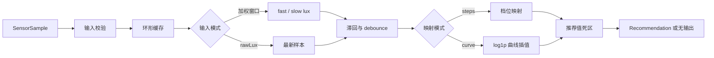

# ContinuousAmbientLightPolicy

`ContinuousAmbientLightPolicy` 是当前模块唯一的环境光策略实现，位于：

- [`continuousambientlightpolicy.h`](continuousambientlightpolicy.h)
- [`continuousambientlightpolicy.cpp`](continuousambientlightpolicy.cpp)

它接收带单调时间戳的 lux 样本，维护环境光状态，并在需要时返回一个 `Recommendation`。策略本身不依赖 Qt D-Bus，不负责读取 DConfig，也不直接设置显示器亮度。

## 处理目标

策略需要同时解决两个问题：

1. **输入稳定性**：过滤非法值、传感器噪声、短时遮挡和阈值附近抖动。
2. **亮度映射**：把稳定后的环境光 lux 转成 `[0.0, 1.0]` 的推荐亮度。

处理链路如下：



## 输入和输出

### 输入：`SensorSample`

```cpp
struct SensorSample {
    double lux;
    double monotonicTimestampMs;
    Source source;
};
```

策略处理输入时遵循以下规则：

- lux 和时间戳必须是有限数值，lux 必须大于等于 `0`。
- 超过 `maxSensorLux`（默认 `100000`）的有限 lux 会饱和到上限，使强光环境稳定输出曲线末端亮度。
- 初始化后，时间戳必须严格晚于上一条样本。

非法样本不会进入缓存，也不会改变策略状态。

### 输出：`Recommendation`

```cpp
struct Recommendation {
    double rawLux;
    double fastLux;
    double slowLux;
    double stableLux;
    double brightness;
};
```

`brightness` 是 Model 和 Service 最终对外发布的值；其余字段用于策略状态、日志和调试。

策略返回 `std::nullopt` 表示当前没有新的推荐值，不代表样本处理失败。

## 内部状态

- `AmbientLightRingBuffer`：保存最近一段时间的 lux 和时间戳。
- `m_fastAmbientLux` / `m_slowAmbientLux`：快、慢窗口结果。
- `m_stableLux`：最近一次被策略接受的稳定 lux。
- `m_lastPublishedBrightness`：最近一次通过推荐值死区并发布的亮度。
- `m_lastTimestampMs`：最近一条传感器样本时间。
- `m_lastEvaluationTimestampMs`：最近一次 `update()` 或 `tick()` 的评估时间。

`reset()` 会清空缓存、稳定值、档位和已发布亮度。算法配置重建，或 Service 因关闭自动亮度、合盖、休眠而 stop 光感时都会执行 reset；重新启用、开盖或唤醒后，Service 会先订阅 `PropertiesChanged` 再重新 Claim，优先把 Claim 期间或之后收到的首个有效 `LightLevel` 作为初始样本。若 2 秒内没有收到变化信号，则延迟读取一次 `LightLevel` 属性作为兜底，避免使用 Claim 时刻可能尚未刷新的缓存值。

## 样本缓存

环形缓存的初始容量根据慢窗口计算，至少保留 8 个样本：

```text
initialCapacity = max(8, ambientLightHorizonMs / 100)
```

每次 `update()` 会先裁剪慢窗口之外的数据，同时保留计算窗口边界所需的前一个样本；如果窗口内的有效样本超过初始容量，缓存按两倍容量增长，不会因采样频率高于 10Hz 而覆盖仍在窗口内的样本。扩容后仍按逻辑顺序访问，正常写入不移动已有数据。

## 两种输入处理模式

### 1. fast/slow 加权窗口：`useWeightedWindows=true`

策略分别在 `fastLightHorizonMs`（默认 1000ms）和 `ambientLightHorizonMs`（默认 10000ms）内计算时间加权平均值：

- `fastLux`：窗口短，响应更快。
- `slowLux`：窗口长，变化更稳定。
- 变亮主要由 `fastLux` 驱动。
- 变暗同时要求 `slowLux` 和 `fastLux` 都达到暗化条件，避免短暂变暗造成亮度快速下降。

权重按样本覆盖的时间区间计算。实现使用权重积分函数：

$$
F(x)=x(0.5x+I)
$$

其中 $I$ 是 `weightingIntercept`（默认 10000），某个样本区间的权重为：

$$
w_i=F(x_{end})-F(x_{start})
$$

最终窗口值为：

$$
L_window = (Σ w_i × lux_i) / Σ w_i
$$

越接近当前时刻的区间权重越大。实现还使用 100ms 的预测尾段，使最新样本在评估时仍有有效覆盖区间。

该模式适合采样频率较高、窗口内有多个样本的传感器。

### 2. 原始样本模式：`useWeightedWindows=false`

关闭窗口计算后：

- `rawLux` 使用最近一条有效样本。
- 变亮和变暗的触发值都基于 `rawLux`。
- 仍然保留滞回、debounce 和推荐值死区。

该模式适合约 800ms 或更低频率的传感器。低频采样时，窗口内样本太少，slow 窗口可能残留旧值，导致响应变慢。

## 初始化

第一条有效样本不会经过方向滞回和 debounce，而是直接建立初始状态：

- 加权模式：`stableLux = fastLux`。
- rawLux 模式：`stableLux = rawLux`。
- 随后按当前 steps 或 curve 模式计算亮度。

初始化会产生第一条 `Recommendation`，让上层尽快得到有效亮度。

## 滞回

初始化完成后，策略以 `stableLux` 为基准建立两个方向不同的阈值。

变亮阈值：

$$
T_{bright}=stableLux+\max(minimumHysteresisLux,\ stableLux\times brightenHysteresisRatio)
$$

变暗阈值：

$$
T_{dark}=stableLux-\max(minimumHysteresisLux,\ stableLux\times darkenHysteresisRatio)
$$

默认比例均为 `0.15`，最小 lux 滞回为 `5.0`。lux 必须先离开当前稳定值一段距离，才会进入对应方向的候选转换。

## debounce

变亮和变暗分别配置：

- `brightenDebounceMs`，默认 2000ms。
- `darkenDebounceMs`，默认 2000ms。

实现采用“最早连续达到或越过阈值时间”语义：

1. 找到最近一次连续达到或越过方向阈值的样本区间。
2. 计算该连续区间的起始时间。
3. 起始时间加上对应方向的 debounce 时长，得到候选转换时间。
4. 中间出现回到阈值内的样本时，本次连续越界失效，需要重新计时。

加权模式下，窗口值负责判断当前是否达到转换条件，缓存中的原始样本时间用于判断连续越界时长。

策略通过 `nextEvaluationDelayMs()` 把候选转换时间交给 Service。没有新传感器事件时，Service 调用 `tick()` 推进时间；`tick()` 不会向缓存插入虚拟样本。

## lux 到亮度映射

配置控制点必须满足：至少两个点；lux 有限、非负且严格递增；brightness 位于 `[0,1]` 且单调不降。配置无效时 Factory 使用内置回退曲线。

### steps 模式

每个控制点对应一个固定亮度档位。首次分类使用相邻 lux 控制点的中点作为中性边界，避免 reset 前后同一 lux 在滞回区间外落入不同档位。对于相邻控制点 $a<b$，运行时使用双向阈值：

$$
T_{bright}=a+r(b-a),\qquad T_{dark}=b-r(b-a)
$$

其中 $r$ 为 `stepHysteresisRatio`，默认 `0.6`。达到阈值并满足 debounce 后切换档位；最低档不调度继续变暗，最高档不调度继续变亮。

### curve 模式

`BrightnessCurve` 在 `log1p(lux)` 空间对控制点分段线性插值：

$$
ratio=\frac{\log(1+lux)-\log(1+lux_{low})}
{\log(1+lux_{high})-\log(1+lux_{low})}
$$

超出曲线范围时使用首尾控制点亮度。最终结果限制在 `[0,1]`，并四舍五入到两位小数。

## 推荐值死区

转换条件满足后，策略会更新 `stableLux` 并计算新的 brightness。如果新亮度与上次发布值的绝对差小于 `minimumRecommendationDelta`（默认 `0.02`），则不返回新的 `Recommendation`。

这层过滤与滞回不同：

- 滞回决定是否允许 lux 状态发生方向转换。
- 推荐值死区决定是否值得向上层发布亮度变化。

## 配置和重置

`ContinuousPolicyConfig` 由 Policy Factory 从 DConfig 构建。主要参数：

| 参数 | 默认值 | 来源 | 作用 |
| --- | ---: | --- | --- |
| `continuousMappingMode` | `steps` | DConfig | 选择档位或连续曲线映射 |
| `continuousLuxCurve` | DConfig 10 点；代码内置 8 点回退 | DConfig | steps 档位或 curve 插值控制点 |
| `brightenDebounceMs` | `2000` | DConfig | 变亮连续确认时间 |
| `darkenDebounceMs` | `2000` | DConfig | 变暗连续确认时间 |
| `useWeightedWindows` | `false` | DConfig | 选择加权窗口或 rawLux 模式 |
| `fastLightHorizonMs` | `1000` | DConfig | 快窗口时长 |
| `ambientLightHorizonMs` | `10000` | DConfig | 慢窗口时长 |
| `stepHysteresisRatio` | `0.6` | DConfig | steps 模式双向滞回比例 |
| `brightenHysteresisRatio` | `0.15` | 代码 | curve 模式变亮滞回比例 |
| `darkenHysteresisRatio` | `0.15` | 代码 | curve 模式变暗滞回比例 |
| `minimumHysteresisLux` | `5.0` | 代码 | curve 模式最小滞回 lux |
| `minimumRecommendationDelta` | `0.02` | 代码 | 推荐值发布死区 |

`setConfig()` 会先整体校验配置；配置无效时不修改当前策略。Factory 还会在外部配置无法构成合法完整策略时回退到内置默认配置。配置生效后会：

1. 替换曲线或档位；steps 未单独提供档位时由曲线控制点生成。
2. 重新计算档位阈值。
3. 按新慢窗口创建可按需增长的环形缓存。
4. 调用 `reset()`，丢弃旧的平滑、滞回和 debounce 状态。

DConfig 字段的 JSON 格式和范围见上级目录的 [`configs/org.deepin.dde.daemon.ambient-brightness.json`](../configs/org.deepin.dde.daemon.ambient-brightness.json)。

## 与上层的接口

| 方法 | 行为 |
| --- | --- |
| `update(sample)` | 写入一条样本并立即评估。 |
| `tick(timestamp)` | 在没有新样本时推进时间并评估 debounce。 |
| `reset()` | 清空样本、状态、档位和已发布亮度。 |
| `nextEvaluationDelayMs()` | 返回下一次需要 `tick()` 的延迟；无需定时评估时返回 0。 |
| `setConfig(config)` | 校验并应用完整配置，成功后重置策略。 |


